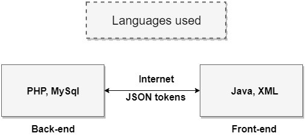

# Outsmart-WebApp
Android application for University academics (named "Outsmart").

APP- https://drive.google.com/file/d/1-47tTwP0x4ZIIIcZ8gUuq0xbSlu6Nkwt/view?usp=drivesdk

"OUTSMART" is an android application designed to serve as a common platform for all university study materials.
It includes sections such as Faculty notes, Textbooks(digital library), Presentations, Video Lectures, Online assignment submission portal, etc. 
The idea of "outsmart" came out because of the online study material which was distributed by emails, managing all the notes was a complete mess.
This problem of management was easily solved by this application.

The version of apk provided is disconnected from the server as it requires login credentials.
Designed on Android Studio.

Languages used
       

•	Platform used for development – Android Studio

Backend Architecture

